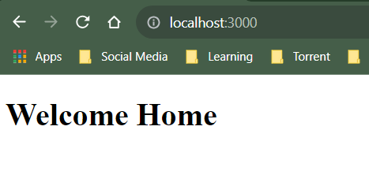
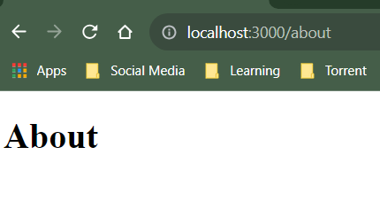
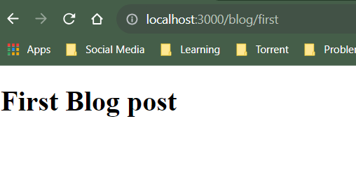
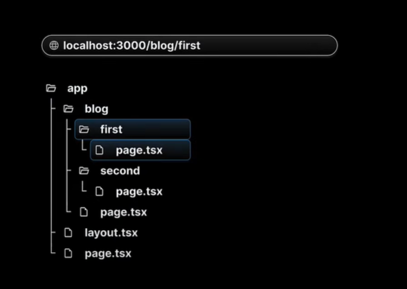
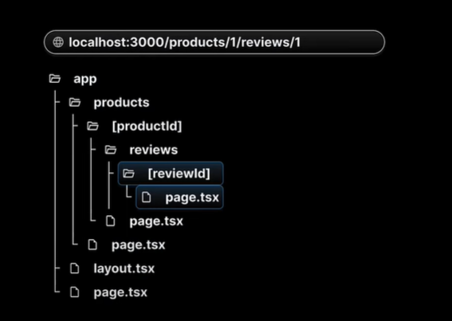

This is a [Next.js](https://nextjs.org/) project bootstrapped with [`create-next-app`](https://github.com/vercel/next.js/tree/canary/packages/create-next-app).

## Getting Started

First, run the development server:

```bash
npm run dev
# or
yarn dev
# or
pnpm dev
# or
bun dev
```

Open [http://localhost:3000](http://localhost:3000) with your browser to see the result.

You can start editing the page by modifying `app/page.tsx`. The page auto-updates as you edit the file.

This project uses [`next/font`](https://nextjs.org/docs/basic-features/font-optimization) to automatically optimize and load Inter, a custom Google Font.

## Leanings in this project -

Here we understood NextJS file based routing technique.
Routing conventions -

#### 1. All routes must be placed inside the app folder

#### 2. Every file that corresponds to a route must be named page.js or page.tsx

#### 3. Every folder corresponds to a path segment in the browser URl

### Scenerio 1: Access home page

For this just create a page.tsx in app folder. It will lead to home page when accessed in browser


### Scenerio 2: Visiting profile or about page <URL>/about or <URL>/profile

Just create a folder like about and inside that create page.tsx. It will behave as route now.


### Scenerio 3: Nested static routes <URL>/blog/first

create nested folders
app -> page.tsx
-> blog(folder) -> page.tsx
-> first(folder) -> page.tsx



### Scenerio 4: Nested Dynamic routes

like <URL>/products/1 where 1 is productId
For this create nested folder but folder name will wrapped with square brackets like [productId]
inside this folder we can create page.tsx
To fetch this product id we can read params from the props of page.tsx

### Scenerio 5: Nested Dynamic Routes

like <URL>/products/1/reviews/1
Create nested dynamic folders to achieve this.
Again we can read dynamic values from props.params


## Catch-all segments features :

If we see in scenerio 5 we have to create multiple subfolders to get a desired path and each path will have its own page.tsx
<URL>/docs/feature1/concept1/example1
So is it possible to have only single page.tsx that will catch all the segments? For this we can use this feature.
Here instead of dynamic folder name we create a folder like this [...slug]
This folder will contain a single page.tsx. Inside this page.tsx we can use slug array to get segments.

Point to notice that this makes slug necessary so <URL>/docs alone will return 404.
So we can use folder name like this [[...slug]] (Optional catch-all segments). and then slug can become option
